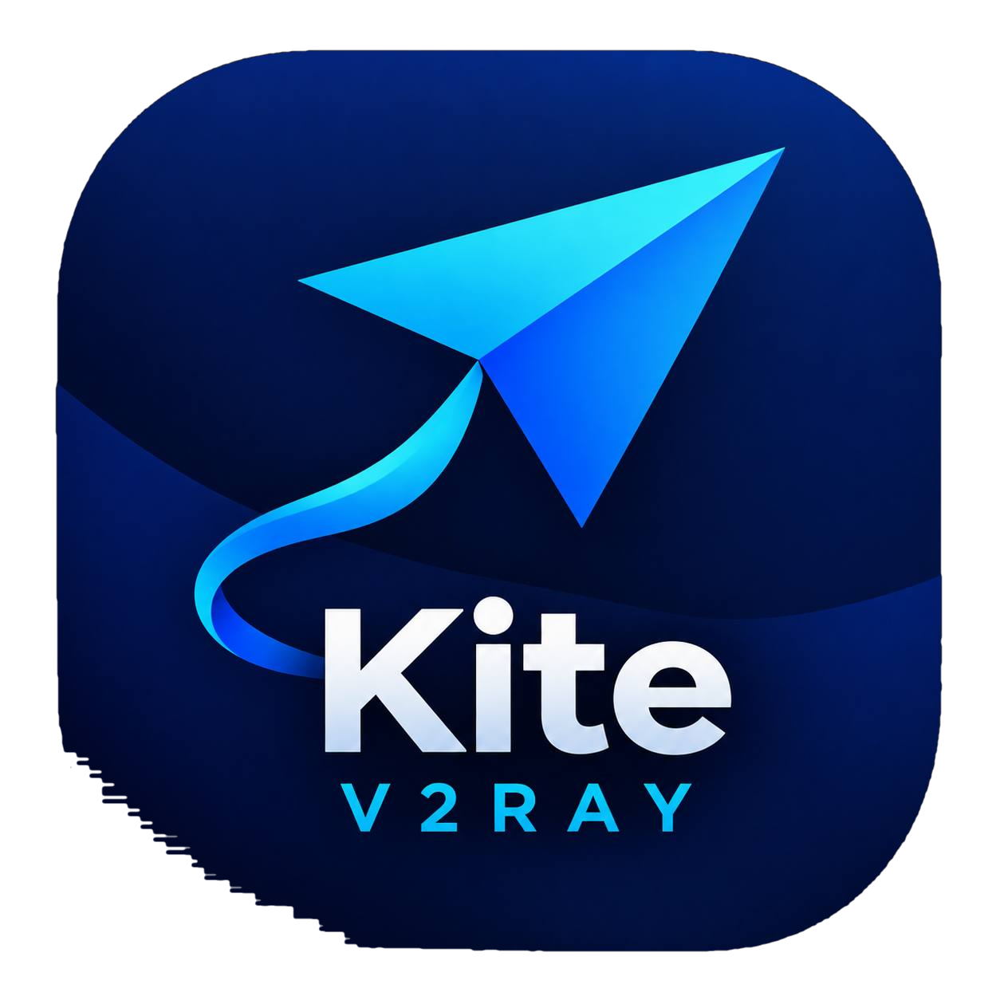
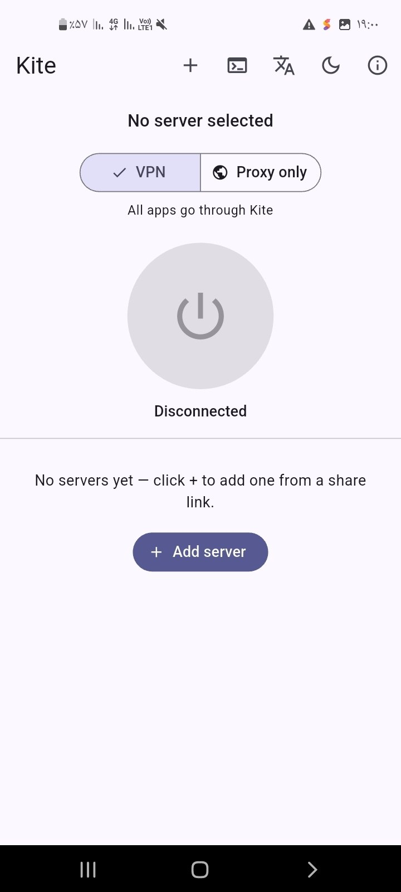
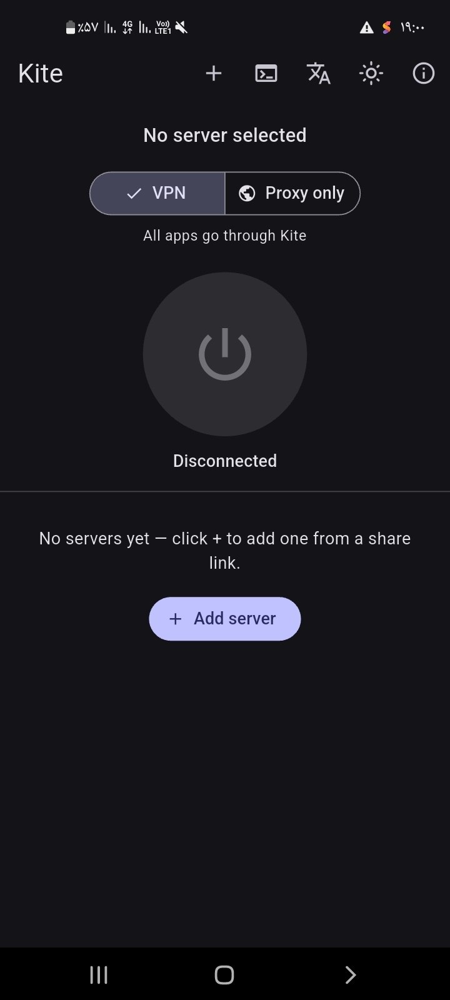

<div align="center">
  

  # Kite for Android & Android TV

  **A free, open-source V2Ray / Xray client for phones, tablets and TVs.**
  Flutter UI, with the same Go core as [Kite for desktop](https://github.com/freeb5d/kite) and xray-core built in.

  [](https://github.com/freeb5d/kite-android/releases/latest)
  [](https://github.com/freeb5d/kite-android/actions/workflows/build.yml)
  [](#-download)
  [](LICENSE)

  [Download](#-download) · [Features](#-features) · [Android TV](#-android-tv) · [Kill switch](#-kill-switch) · [How it works](#-how-it-works) · [Building](#-building)
</div>

---

## 📥 Download

Get **`kite-android-universal.apk`** from the **[Releases page](https://github.com/freeb5d/kite-android/releases/latest)**.

There is **one APK for every device**: it includes the engine for every Android CPU type
(ARM 64-bit, ARM 32-bit, x86_64 and x86), so it installs on any phone, tablet, Android TV or
TV box running Android 7.0 or newer. No need to pick the right file.

1. Download the APK on your device (or copy it over).
2. Open it and allow "Install unknown apps" for your browser or file manager when Android asks.
3. Open Kite, tap **+**, paste a link or subscription URL, and connect.

Kite checks GitHub for new versions on launch and can update itself in one tap.

## 📸 Screenshots

<p align="center">
  
  &nbsp;&nbsp;
  
</p>

## ✨ Features

- **All common link types** — `vmess://`, `vless://`, `trojan://`, `ss://`. Paste one link, or
  several at once.
- **Every subscription format** — base64 link lists (V2RayN/V2RayNG/3x-ui/Marzban), Clash/Mihomo
  YAML, sing-box JSON, Xray JSON and Shadowsocks SIP008. Unsupported entries are skipped, not fatal.
- **Subscription groups** — each subscription is one collapsible group with **sync**, **share**
  (copy the URL, or all its servers as links), **edit** (rename / change URL) and **delete**.
  Shows traffic used, plan size and expiry date when the provider reports them, and re-syncs
  automatically when the provider's update interval has passed.
- **Transports & security** — TCP (including `headerType=http` disguise), WebSocket and gRPC,
  with TLS, REALITY and uTLS fingerprints.
- **Two modes**
  - **VPN** — every app goes through Kite, using Android's built-in VPN service (no root).
  - **Proxy only** — no VPN, just a local proxy other apps can use:
    HTTP `127.0.0.1:10809`, SOCKS5 `127.0.0.1:10808`.
- **Share, rename, delete** any server; **ping all** servers to find the fastest.
- **Connection test** — makes a real request through the tunnel and shows your exit IP,
  country and delay.
- **Live and total traffic**, plus the xray-core log for troubleshooting.
- **Notification with a Disconnect button** while connected.
- **In-app updates** from GitHub Releases.
- **8 languages** — English, 中文, فارسی, Türkçe, العربية, Français, Deutsch, Русский.
- **Dark and light themes.**

## 📺 Android TV

Kite appears on the TV home screen with its own banner and works fully with the **remote
control**: arrow keys move between items, **OK** selects, and the power button gets focus
first so you can connect with a single press. On TVs and tablets the layout switches to two
panes: servers on the left, connection on the right.

Tip: to add servers on a TV, copy the subscription URL on your phone and paste it with a
keyboard app, or use a remote/phone app that can type text.

## 🛡️ Kill switch

Android has a kill switch built in, and it's more reliable than anything an app can do
itself. In Kite, open **About → Always-on VPN**, then in Android's VPN settings:

1. Tap the ⚙️ next to **Kite**.
2. Turn on **Always-on VPN**.
3. Turn on **Block connections without VPN**.

Android will then block all internet traffic whenever Kite isn't connected.

## 🔧 How it works

```
kite-android/
├── core/                  Go core, compiled to an Android library (.aar) with gomobile
│   └── kitecore.go        links, subscriptions, share links, start/stop xray-core,
│                          traffic, connection test, ping
├── app/                   Flutter app
│   ├── lib/
│   │   ├── main.dart      UI (phone + TV layouts)
│   │   ├── core.dart      bridge to the native side (method/event channels)
│   │   ├── store.dart     saved servers & settings
│   │   └── i18n.dart      8 languages (generated from the desktop app's translations)
│   └── android/app/src/main/kotlin/com/freeb5d/kite/
│       ├── KiteVpnService.kt  VpnService: creates the tunnel, hands it to xray-core,
│       │                      foreground notification with Disconnect
│       └── MainActivity.kt    method channel → Go core, VPN permission, APK updates
└── .github/workflows/build.yml
```

- **Same code as desktop.** Link parsing, subscription formats, share links and the xray-core
  config come from the desktop repo's public packages
  ([`pkg/profile`](https://github.com/freeb5d/kite/tree/main/pkg/profile),
  [`pkg/xrayconf`](https://github.com/freeb5d/kite/tree/main/pkg/xrayconf)), so both apps
  understand exactly the same links.
- **VPN mode.** Android's `VpnService` creates the tunnel and gives Kite a file descriptor;
  xray-core's TUN inbound reads packets from it. Kite excludes its own app from the VPN, so
  xray-core's connection to your server (and its DNS lookups) go out directly instead of
  looping back into the tunnel. DNS for other apps goes through the tunnel to `1.1.1.1`.

## 🛠️ Building

Everything is built by GitHub Actions ([`build.yml`](.github/workflows/build.yml)):

1. `gomobile bind` compiles the Go core for all four Android CPU types into `kitecore.aar`.
2. `flutter build apk --release` builds one universal APK, signed with the release key from
   the repository secrets (`KEYSTORE_B64`, `KEYSTORE_PASSWORD`, `KEY_ALIAS`).
3. Pushing a `v*` tag publishes the APK as a GitHub Release, with that version's section of
   [CHANGELOG.md](CHANGELOG.md) as the release notes.

To build locally you need Go 1.27+, the Android SDK + NDK, `gomobile` and Flutter; then run
the same commands as the workflow.

## 🤝 Contributing

Issues and pull requests are welcome, in the
[issue tracker](https://github.com/freeb5d/kite-android/issues).

## 📄 License

[MIT](LICENSE)
